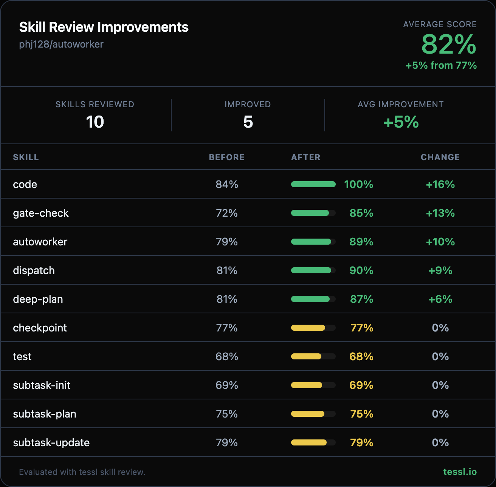

Hey @phj128 👋

I ran your skills through `tessl skill review` at work and found some targeted improvements. Here's the full before/after:

| Skill | Before | After | Change |
|-------|--------|-------|--------|
| autoworker | 79% | 89% | +10% |
| code | 84% | 100% | +16% |
| deep-plan | 81% | 87% | +6% |
| dispatch | 81% | 90% | +9% |
| gate-check | 72% | 85% | +13% |

I kept this PR focused on the 5 skills with the biggest improvements to keep the diff reviewable. Happy to follow up with the rest in a separate PR if you'd like.

Changes summary

**All 5 skills — Description improvements:**
- Converted YAML pipe (`|`) / chevron (`>`) block scalars to quoted strings for standard frontmatter format
- Added explicit "Use when..." trigger clauses so agents can better match user intent to the right skill
- Added natural language trigger terms (e.g. "building a feature", "planning a feature", "resuming work") alongside internal skill references
- Made action descriptions more concrete and specific

**autoworker:**
- Narrowed scope from "any non-trivial implementation task" to "multi-file implementation tasks" to reduce conflict risk with simpler coding skills
- Removed duplicate "Recovery after /clear" section that restated content already covered in the dedicated recovery section below
- Removed redundant verified failure modes that were stated 3 times across different sections

**code:**
- Added natural trigger terms ("implement next phase", "coding the next step", "writing code for a planned phase") — content was already scored 100%

**deep-plan:**
- Trimmed verbose "Core idea" paragraph that restated what the description already covers
- Added concrete action verbs ("asks clarifying questions", "surfaces hidden assumptions", "identifies design trade-offs")

**dispatch:**
- Merged redundant "Key Constraints" and "Important Notes" sections into a single "Constraints" section, removing points already stated in the workflow

**gate-check:**
- Added "Use when..." clause with natural terms ("quality check", "task completion verification", "pre-delivery review")
- Condensed 4 boundary examples into 2 concise rules (programmatically verifiable vs. human-sense-dependent)

Honest disclosure — I work at @tesslio where we build tooling around skills like these. Not a pitch - just saw room for improvement and wanted to contribute.

Want to self-improve your skills? Just point your agent (Claude Code, Codex, etc.) at [this Tessl guide](https://docs.tessl.io/evaluate/optimize-a-skill-using-best-practices) and ask it to optimize your skill. Ping me - [@yogesh-tessl](https://github.com/yogesh-tessl) - if you hit any snags.

Thanks in advance 🙏
